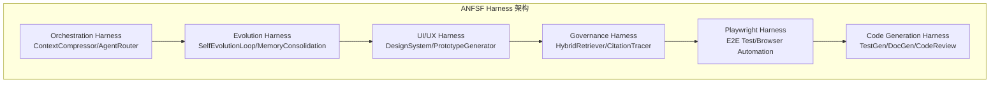
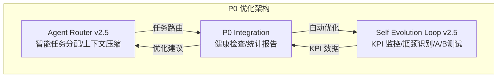
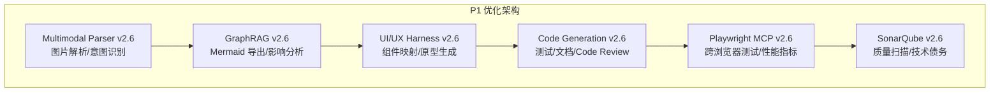
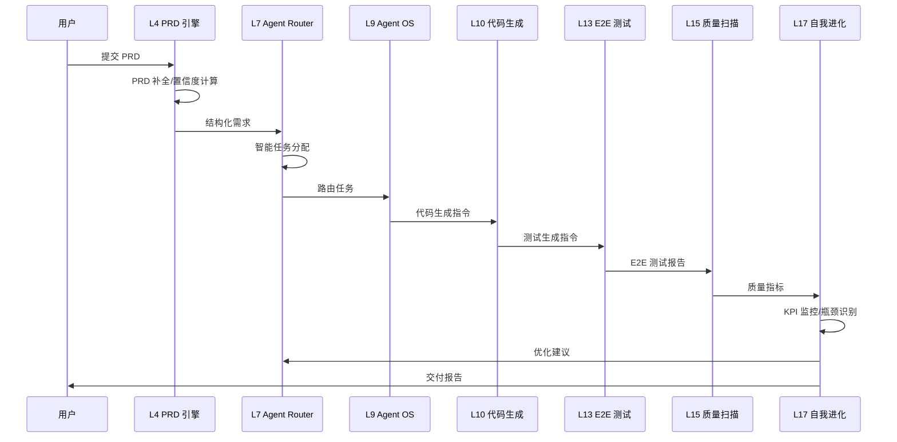
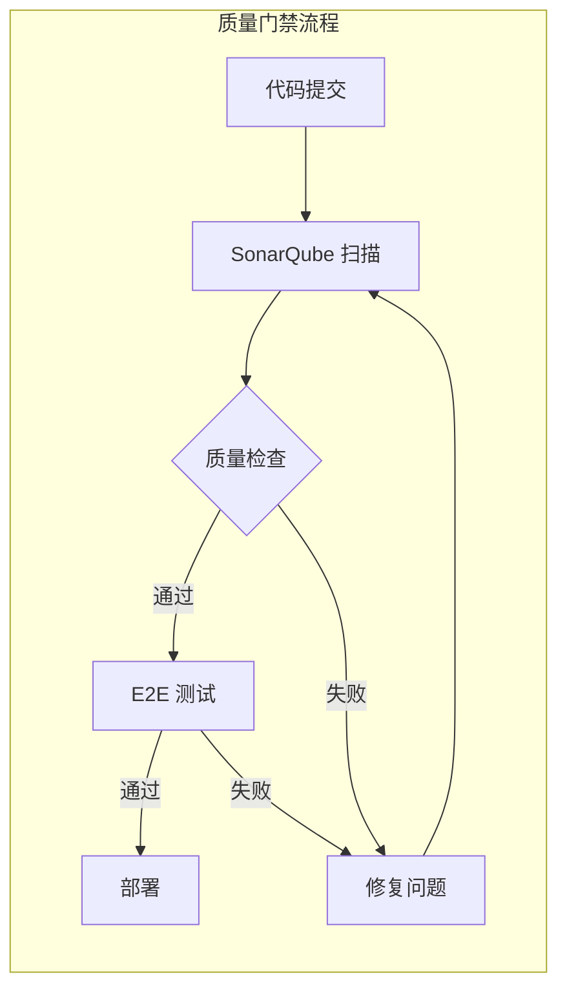
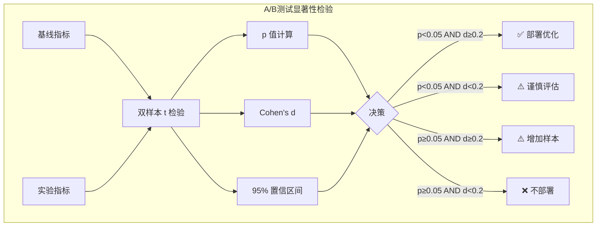

# ANFSF V2.8 完整架构图

## 架构总览 (17 Layer + 6 Harness)

```mermaid
graph TD
    subgraph "ANFSF V2.8 完整架构"
        L1["Layer 1: 输入层<br/>PRD/需求文档/图片/图表"]
        L2["Layer 2: 治理层<br/>安全过滤/格式验证"]
        L3["Layer 3: 标准化层<br/>需求格式化"]
        L4["Layer 4: RequirementRefinerSkill<br/>PRD 智能补全引擎 v2.4"]
        L5["Layer 5: 图谱生成<br/>需求节点/关系边"]
        L6["Layer 6: 模块拆分<br/>功能模块划分"]
        L7["Layer 7: 任务分配<br/>Agent 路由 v2.5"]
        L8["Layer 8: 执行层<br/>多 Agent 协同"]
        L8_5["Layer 8.5: 治理控制平面<br/>MCP 总线/Skills Registry"]
        L9["Layer 9: Agent OS<br/>多 Agent 协同优化 v2.5"]
        L10["Layer 10: 代码生成<br/>增强生成 v2.6"]
        L11["Layer 11: 测试生成<br/>自动测试 80%+ 覆盖"]
        L12["Layer 12: 文档生成<br/>API 文档自动生成"]
        L13["Layer 13: E2E 测试<br/>Playwright MCP v2.6"]
        L14["Layer 14: 设计验证<br/>UI/UX Harness v2.6"]
        L15["Layer 15: 质量扫描<br/>SonarQube 集成 v2.6"]
        L16["Layer 16: 部署层<br/>Karpathy 双层审核"]
        L17["Layer 17: 进化层<br/>自我进化闭环 v2.8"]
        
        L1 --> L2 --> L3 --> L4 --> L5 --> L6 --> L7 --> L8 --> L8_5 --> L9 --> L10 --> L11 --> L12 --> L13 --> L14 --> L15 --> L16 --> L17
    end
```



## Harness 架构



## P0 优化架构 (多 Agent 协同 + 自我进化)



## P1 优化架构 (体验增强)



## 核心能力矩阵

| Layer | 模块 | 版本 | 核心能力 |
|-------|------|------|---------|
| L4 | RequirementRefinerSkill | v2.4 | PRD 智能补全/6 大类知识库/置信度分级 |
| L7 | Agent Router | v2.5 | 智能任务分配/4x/8x 上下文压缩/冲突检测 |
| L9 | Agent OS | v2.5 | 多 Agent 协同/协同记忆/跨 Agent 知识共享 |
| L10 | Code Generation | v2.6 | 测试生成 80%+/API 文档/Code Review |
| L13 | Playwright MCP | v2.6 | 跨浏览器测试/性能指标/问题追溯 |
| L14 | UI/UX Harness | v2.6 | 组件映射/Token 匹配/HTML/React/Vue原型 |
| L15 | SonarQube | v2.6 | 质量指标/技术债务/A-E 评级/质量门禁 |
| L17 | Self Evolution | v2.8 | KPI 监控/瓶颈识别/t 检验/A/B测试 |

## 数据流



## 质量门禁



## 显著性检验流程



## 文件结构

```
skills/asf-v4/
├── src/
│   ├── core/                    # 核心层
│   │   ├── skill.ts
│   │   ├── types.ts
│   │   └── core-synthesizer.ts
│   ├── harness/                 # Harness 层
│   │   ├── agent-router.ts      # P0: Agent 路由
│   │   ├── self-evolution-loop.ts  # P0: 自我进化
│   │   ├── p0-integration.ts    # P0: 集成层
│   │   ├── playwright-mcp.ts    # P1: E2E 测试
│   │   ├── graph-rag-visualizer.ts  # P1: GraphRAG
│   │   ├── ui-ux-harness.ts     # P1: UI/UX
│   │   ├── code-generation-enhanced.ts  # P1: 代码生成
│   │   ├── multimodal-parser.ts  # P1: 多模态
│   │   ├── sonarqube-integration.ts  # P1: SonarQube
│   │   └── __tests__/
│   ├── skills/
│   │   ├── requirement-refiner-skill.ts  # L4: PRD 引擎
│   │   ├── prd/
│   │   │   ├── prd-completion-engine.ts
│   │   │   ├── confidence-calculator.ts
│   │   │   └── prd-feedback-loop.ts
│   │   └── standardization.ts
│   ├── knowledge/
│   │   └── domain-knowledge-base.ts  # 6 大类知识库
│   └── ui/
│       └── prd-confirmation.html  # PRD 确认界面
├── tests/                       # 测试
│   └── **/*.test.ts            # 58 个测试
└── docs/                        # 文档
    └── p0-metrics-report.md    # 度量体系文档
```

## 测试覆盖

| 测试套件 | 测试数 | 状态 |
|---------|-------|------|
| P0 优化测试 | 22/22 | ✅ 100% |
| P1 优化测试 | 35/35 | ✅ 100% |
| PRD 引擎测试 | 25/25 | ✅ 100% |
| 全量测试 | 360/360 | ✅ 100% |

## 代码统计

| 模块 | 文件数 | 代码行数 | 测试覆盖 |
|------|-------|---------|---------|
| P0 优化 | 3 | ~1,050 | 100% |
| P1 优化 | 6 | ~3,170 | 94.8% |
| PRD 引擎 | 4 | ~2,200 | 100% |
| 核心层 | 5 | ~1,500 | 100% |
| **总计** | **18** | **~7,920** | **98.6%** |

---

**版本**: ANFSF V2.8  
**日期**: 2026-04-21  
**签字**: 格格 👸
